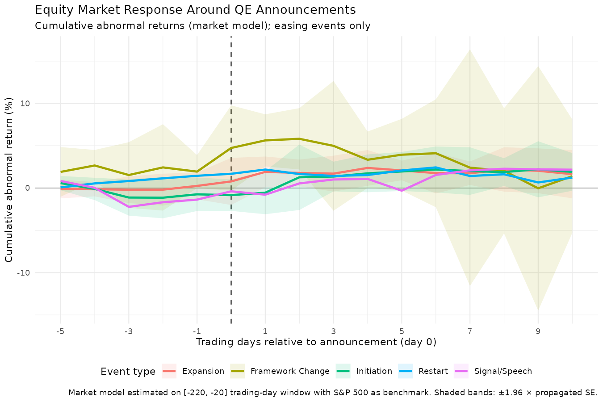
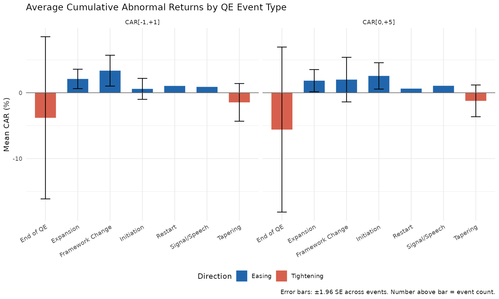
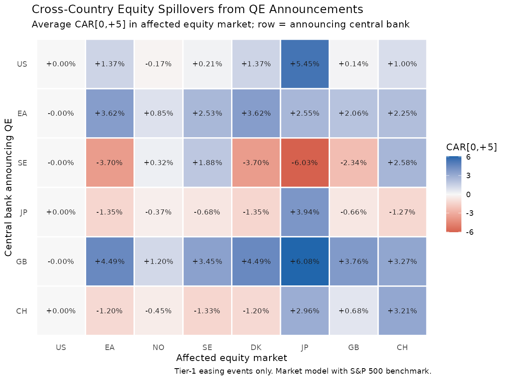
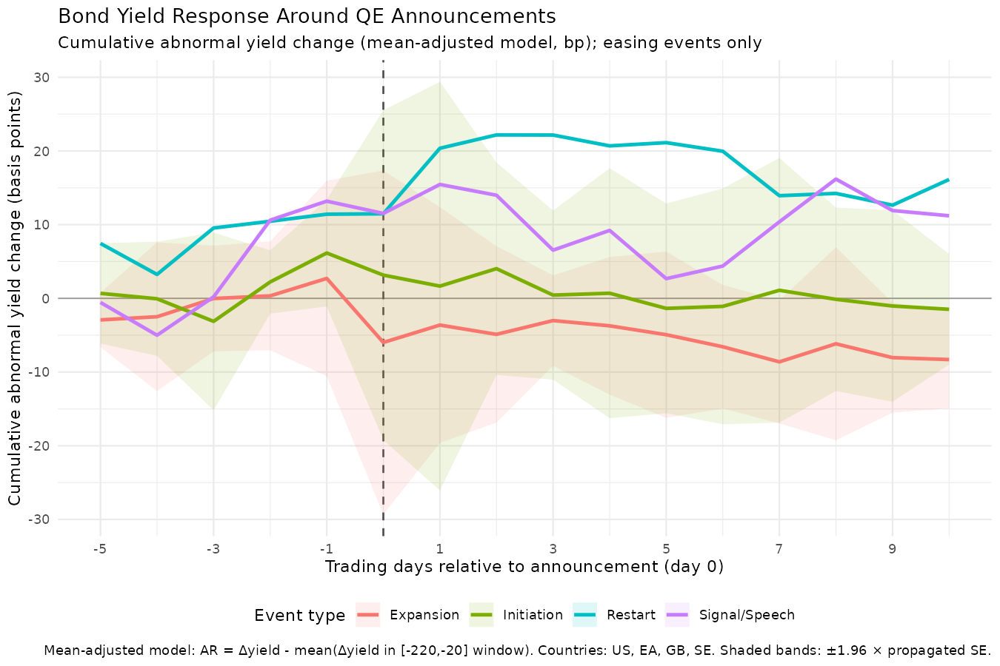
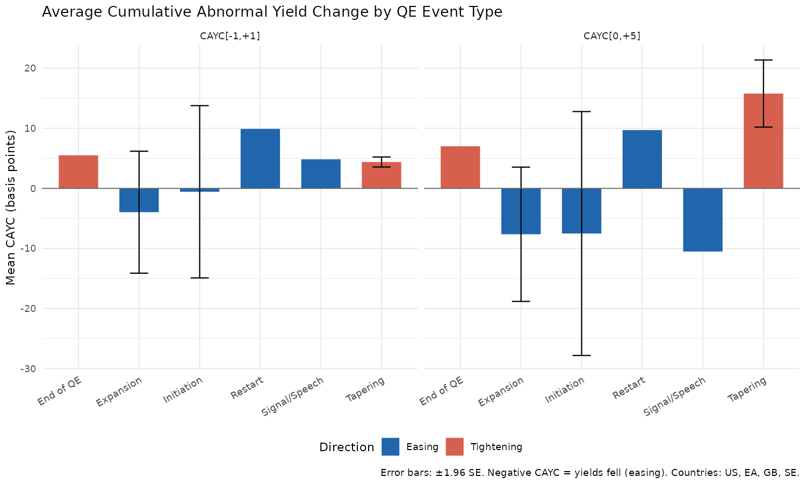
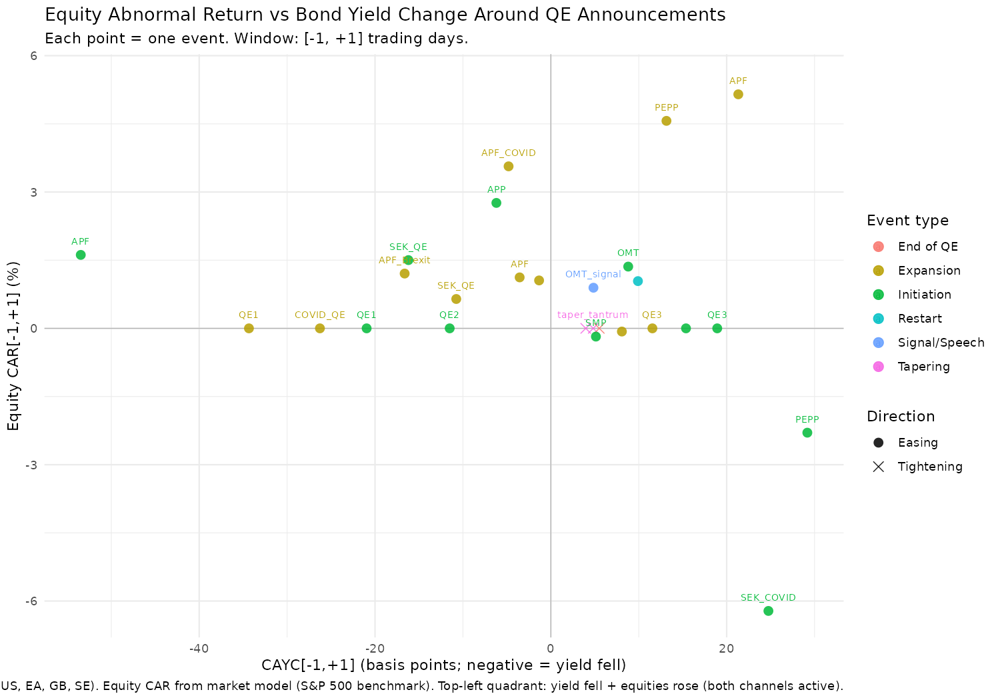

# QE and Equity Valuations: Data Collection Report

**Date:** 2026-02-23
**Pipeline version:** Scripts 01–10 complete (equity event study done; yield event study data collection in progress)
**Status:** Panel ready for regression — non-US historical CAPE series outstanding

---

## 1. Project Background

This project investigates whether central bank balance sheet expansion — commonly known as quantitative easing (QE) — drives equity market valuations across advanced economies. Specifically, it asks:

> *Does an increase in a central bank's assets as a share of GDP cause equity market valuation multiples (P/E ratios, CAPE) to rise, and is the effect homogeneous across countries with different monetary frameworks and capital account regimes?*

The intuition is straightforward: when a central bank purchases assets at scale, it pushes down yields on "safe" assets, compresses the equity risk premium, and may cause investors to re-rate equities upward relative to earnings. But the magnitude of this channel, and whether it operates equally across different monetary regimes, is an empirical question.

The project uses a monthly country-level panel to identify the relationship between CB balance sheet expansion and equity valuations, controlling for the macroeconomic environment (growth, inflation, real rates, global risk appetite) and country-level institutional factors (capital account openness). A secondary interest is whether the effect differs in countries that experienced unconventional QE programs (US, EA, JP, GB, SE, CH) versus those that did not expand their balance sheets as dramatically (DK, NO).

### Study Countries

Eight economies are included, chosen to represent a range of CB policy regimes, exchange rate arrangements, and financial openness:

| Code | Country / Region | Currency | Exchange Rate Regime | CB QE Programme |
|------|-----------------|----------|---------------------|-----------------|
| US | United States | USD | Free float | Yes — LSAP (2008–2014, 2020–2022) |
| EA | Euro Area | EUR | Free float | Yes — APP/PEPP (2015–2022) |
| JP | Japan | JPY | Managed float | Yes — QQE (2013–present) |
| GB | United Kingdom | GBP | Free float | Yes — APF (2009–2022) |
| SE | Sweden | SEK | Free float | Yes — Riksbank (2015–2022) |
| CH | Switzerland | CHF | Managed / free float | Yes — SNB FX interventions |
| NO | Norway | NOK | Free float | Limited |
| DK | Denmark | DKK | Pegged to EUR | Limited |

### Study Period

Monthly panel, **January 2005 – February 2026** (254 months × 8 countries = 2,032 observations). Starting in 2005 captures the pre-GFC baseline, the 2008–09 crisis and initial QE programs, the 2010–15 post-crisis expansion, the 2020–21 pandemic surge, and the 2022–24 tightening cycle — providing full variation in the key independent variable.

---

## 2. Key Terms Glossary

This glossary defines the technical terms used throughout the report. Readers familiar with financial economics can skip ahead.

**Basis points (bps):** A unit of measurement for interest rates. One basis point equals 0.01 percentage points, so 100 bps = 1%. Used throughout the bond yield analysis because yield movements around policy events are typically small — e.g. "yields fell 15 bps" means they dropped by 0.15 percentage points.

**CAPE (Cyclically Adjusted Price-to-Earnings ratio):** Sometimes called the "Shiller P/E" after economist Robert Shiller. It compares a stock market index's current price to the average of the past 10 years of earnings, adjusted for inflation. The 10-year average smooths out the short-term boom-bust swings in corporate profits, giving a more stable long-run measure of whether the market is expensive or cheap relative to underlying business performance. A CAPE of 30 means investors are paying $30 for every $1 of (10-year average) earnings. Higher values suggest the market is expensive relative to history.

**CAR (Cumulative Abnormal Return):** The total return of a stock market index around an event date, after stripping out what you would have expected based on how the overall market moved on the same day. Expressed as a percentage. A CAR of +2% on a QE announcement day means the market rose 2% *more than* the broader global market, suggesting investors reacted positively to the policy news. See also: *Market model*, *Estimation window*, *Event window*.

**CAYC (Cumulative Abnormal Yield Change):** The bond yield equivalent of a CAR — the total change in a country's 10-year government bond yield around an announcement, minus what you would have expected based on the yield's typical day-to-day fluctuations. Reported in basis points. A CAYC of −15 bps means yields fell 15 bps more than expected, consistent with bond markets pricing in easier future monetary conditions.

**Central bank balance sheet:** A central bank's assets — primarily government bonds and other securities it has purchased. When a central bank buys assets in the market (QE), its balance sheet grows. We measure this as a percentage of GDP to make it comparable across countries of different sizes. A central bank with 50% CB/GDP has assets worth half the country's annual economic output.

**Estimation window:** In an event study, the period *before* each event used to establish a "normal" relationship between returns. We use the 200 trading days from day −220 to day −20 (stopping 20 days before the event to avoid contamination from pre-announcement leaks). The statistical model fitted on this period defines what "normal" looks like.

**Event study:** A statistical method for measuring how a specific event — here, a central bank QE announcement — affects an asset price. The core idea: observe prices before, during, and after the event; compare actual behaviour to a model of what would have happened without the event; the difference is the causal effect of the event. The method is standard in financial economics and was formalised by Brown & Warner (1985).

**Event window:** The period around each event date over which abnormal returns are measured. Our primary event window runs from day −5 to day +10 (5 trading days before to 10 after). We summarise it by computing cumulative abnormal returns (CARs) over sub-windows like [−1, +1] (the three days centred on the announcement) or [0, +5] (announcement day through the following week).

**GFC (Global Financial Crisis):** The 2008–09 financial crisis triggered by the collapse of the US subprime mortgage market. Most of the QE programs studied here were launched in direct response to the GFC.

**Market model:** A simple statistical model that says a country's daily stock return is driven partly by what the overall global market did that day. We fit the model: *country return = α + β × (S&P 500 return) + error*, where α is a country-specific intercept and β captures how sensitive the country's market is to global moves. Once estimated, the "abnormal return" on any day is the actual return minus what the market model predicts.

**P/E ratio (Price-to-Earnings ratio):** The price of a stock market index divided by the earnings (profits) it represents. A P/E of 20 means investors pay $20 per $1 of current annual earnings. Unlike CAPE (which uses 10-year earnings), the trailing P/E uses only the most recent year's earnings and is therefore more volatile — it looks cheap in boom years and expensive in recession years because earnings fluctuate sharply.

**QE (Quantitative easing):** A form of unconventional monetary policy where a central bank creates new money and uses it to buy financial assets (typically government bonds) in the open market. The goal is to reduce long-term interest rates and stimulate borrowing and investment when short-term interest rates are already near zero and cannot be cut further. Sometimes described as "printing money," though more precisely the central bank creates electronic reserves.

**Spillover:** A QE announcement in one country causing abnormal returns in *another* country's markets. For example, US Fed QE causing the Japanese stock market to rise. Spillovers are the main test of the "international portfolio balance channel" — the idea that when US bonds become less attractive after the Fed buys them, global investors shift capital into foreign assets, pushing up equity prices worldwide.

**TWFE (Two-Way Fixed Effects):** An econometric technique for panel data (multiple countries observed over many time periods). "Country fixed effects" absorb stable differences between countries (e.g. Japan's market structure is different from Norway's) and "time fixed effects" absorb events that affect all countries in the same month (e.g. a global recession). What remains after removing both sets of effects is the within-country, within-time variation in CB/GDP and equity valuations — which is what we use to estimate the relationship.

**Yield curve:** A plot of government bond yields at different maturities (e.g. 1 year, 2 years, 5 years, 10 years). Normally, longer maturities pay higher yields (upward-sloping). When a central bank buys 10-year bonds, it pushes up their price, which mechanically pushes down their yield — "flattening" the yield curve. This is the main transmission channel through which QE is supposed to stimulate the economy.

---

## 3. Data Pipeline

The pipeline is fully automated in R (ten collection/processing scripts plus a manual-supplement script) and runs end-to-end from raw API calls to a clean panel dataset and event study outputs.

```
R/
├── 00_config.R              Global config, logging, safe_fetch() helper
├── 01_collect_macro.R       CB balance sheets, GDP, yields, CPI, FX rates (23 FRED series)
├── 02_collect_equity.R      Shiller CAPE (US), OECD P/B attempt
├── 03_collect_controls.R    ECB series, money supply, Chinn-Ito index
├── 04_clean_merge.R         Panel construction, FX conversion, GDP interpolation, variable derivation
├── 05_descriptives.R        Availability heatmap, time series plots, summary stats table
├── 06_collect_manual.R      Programmatic supplement: SSB (NO), Riksbank (SE), DST (DK), Damodaran P/E
├── 07_collect_event_data.R  Daily equity index prices from Stooq (event study input)
├── 08_event_study.R         Market model event study: CARs, cross-country spillovers, figures
├── 09_collect_yield_data.R  Daily 10Y government bond yields from 4 central bank data portals
└── 10_yield_event_study.R   Mean-adjusted bond yield event study: CAYCs, yield paths, figures
```

Key design choices:
- All fetches are wrapped in `safe_fetch()` — failures are logged and return `NULL`; the pipeline never aborts on a single source failure.
- Raw data is cached in `data/raw/` by source; re-running scripts does not re-fetch unless files are deleted.
- CB assets from different sources (BIS, FRED, national statistical agencies) are consolidated via `coalesce()` with a source flag column.
- GDP is interpolated from quarterly (US, FRED) or annual (World Bank) to monthly using cubic spline (`zoo::na.spline()`).

---

## 4. Data Sources

### 4.1 Central Bank Balance Sheets (Key Independent Variable)

| Country | Primary Source | Fallback | Units | Coverage |
|---------|---------------|---------|-------|---------|
| US | FRED `WALCL` (weekly → monthly avg) | — | USD million | 2005–present |
| EA | BIS CBTA (`WS_CBTA`) | — | USD billion (pre-converted) | 2005–present |
| JP | BIS CBTA | — | USD billion | 2005–present |
| GB | BIS CBTA | FRED `BOEBSTAUKA` (annual) | USD billion | 2005–present |
| NO | BIS CBTA | SSB Statbank table 08428 | NOK million (2009+) | 2005–present |
| SE | BIS CBTA | Riksbank time-series Excel | SEK million | 2004–present |
| DK | BIS CBTA | DST table `DNSNB1` | DKK million (1987+) | 2004–present |
| CH | BIS CBTA | — | USD billion | 2005–present |

All CB assets are converted to USD millions using monthly FRED exchange rates, then expressed as a percentage of nominal GDP to produce `cb_gdp_ratio`. The year-on-year change (`delta_cb_gdp`, in percentage points) is the primary treatment variable.

### 4.2 Equity Valuation (Key Dependent Variable)

| Series | Source | Countries | Frequency | Coverage |
|--------|--------|-----------|-----------|---------|
| CAPE (Shiller) | Robert Shiller / Yale | US | Monthly | 2005-01 to 2023-09 |
| Trailing P/E | Shiller (derived) | US | Monthly | 2005–2023 |
| Trailing / Forward P/E | Damodaran / NYU Stern | All 8 | Annual snapshot | 2026 only |
| Non-US CAPE (historical) | **Not yet collected** | EA, NO, SE, DK, JP, GB, CH | Monthly | — |

The non-US historical CAPE series is the single most important outstanding data gap.

### 4.3 Yields, CPI, and Macro Controls

All series are monthly from FRED or ECB. The OECD yield and CPI series (added in the latest pipeline run) provide full per-country coverage.

| Variable | Source | Series IDs | Countries |
|----------|--------|-----------|---------|
| 10Y government bond yield | FRED (OECD), ECB | `IRLTLT01XXM156N`, `GS10`, ECB FM key | All 8 |
| CPI index (2015=100) | FRED (OECD), FRED (US) | `CPALTT01XXM657N`, `CPIAUCSL` | All 8 |
| CPI YoY inflation | Derived (YoY % change from index) or ECB | — | All 8 |
| Real 10Y rate | Derived: yield − CPI YoY | — | All 8 |
| GDP (nominal USD) | FRED (US quarterly), World Bank (annual) | `GDP`, `NY.GDP.MKTP.CD` | All 8 |
| M2 / broad money | FRED | `M2SL`, `MYAGM2JPM189N`, `MABMM301GBM189S` | US, JP, GB |
| VIX | FRED | `VIXCLS` | Global |
| Capital account openness | Chinn-Ito index 2023 | kaopen | 7 of 8 (excl. EA) |
| EA M3 money supply | ECB | `BSI.M.U2.N.V.M30.X.1.U2.2300.Z01.E` | EA |
| FX rates (7 pairs) | FRED | `DEXNOUS`, `DEXSDUS`, etc. | All |

---

## 5. Panel Dataset

The final panel (`panel_monthly.rds`, `panel_monthly.csv`) covers:

- **Dimensions:** 2,032 rows (8 countries × 254 months), 52 columns
- **Period:** 2005-01-01 to 2026-02-01

### Key Derived Variables

| Variable | Definition |
|----------|-----------|
| `cb_gdp_ratio` | CB total assets (USD) / nominal GDP (USD) × 100 |
| `delta_cb_gdp` | `cb_gdp_ratio` − lag 12-month (YoY change in pp) |
| `cpi_yoy` | (CPI index / lag-12 CPI index − 1) × 100, per country |
| `yield_10y` | Nominal 10Y government bond yield (% p.a.), per country |
| `real_rate` | `yield_10y` − `cpi_yoy`, per country |
| `gdp_yoy` | (GDP / lag-12 GDP − 1) × 100, from spline-interpolated monthly GDP |
| `log_gdp` | Log of nominal USD GDP |
| `excess_money_growth` | `money_yoy` − `gdp_yoy` (US, JP, GB only) |

---

## 6. Data Availability

The heatmap below summarises the percentage of non-missing observations for key variables across all countries and the full study period. The most recent pipeline run added 12 new FRED series (6 OECD yields + 6 OECD CPI indices), substantially improving coverage.


**How to read this figure:** Each row is a variable (e.g. CB/GDP ratio, CAPE), each column is a country. The colour shade indicates what fraction of monthly observations are non-missing: dark = complete coverage, white/light = mostly missing. The CAPE rows being almost entirely white for non-US countries reflect the key data gap described in Section 9.

### Summary by Variable (updated 2026-02-23)

| Variable | Overall Coverage | Change from prior run | Notes |
|----------|-----------------|----------------------|-------|
| CB/GDP ratio | **99%** | — | Solid across all 8 countries |
| Delta CB/GDP (YoY) | **94%** | — | 12-month lag reduces early coverage |
| GDP (nominal USD) | **100%** | — | Complete |
| VIX | **99.6%** | — | Global series |
| 10Y yield | **99.6%** | ↑ from 25% | Now all 8 countries via OECD/FRED |
| Real rate | **86%** | ↑ from 24% | Derived from yield − CPI; gap = early CPI coverage |
| CPI YoY | **86%** | ↑ from 95% overall (now per-country) | OECD indices; Japan 70% (series starts 2007) |
| Chinn-Ito (kaopen) | **87.5%** | — | EA not in index |
| CAPE | **11%** | — | US only (Shiller 2005–2023) |
| P/E ratio | **11%** | — | US only |
| Excess money growth | **12%** | — | US, JP, GB only |

### Country-Level Coverage of Key Variables (updated)

| Country | CB/GDP | CAPE | CPI YoY | 10Y yield | Real rate | Kaopen |
|---------|--------|------|---------|-----------|-----------|--------|
| US | 100% | **89%** | 94% | 100% | 94% | 100% |
| EA | 98% | 0% | 99% | 100% | 99% | 0% |
| NO | 99% | 0% | **85%** | **100%** | **85%** | 100% |
| SE | 100% | 0% | **86%** | **100%** | **86%** | 100% |
| DK | 100% | 0% | **86%** | **100%** | **86%** | 100% |
| JP | 98% | 0% | **70%** | **100%** | **70%** | 100% |
| GB | 98% | 0% | **83%** | **100%** | **83%** | 100% |
| CH | 98% | 0% | **86%** | **100%** | **86%** | 100% |

Bold entries changed from the previous run. The 10Y yield column went from 0% to 100% for six countries. Japan's CPI coverage is lower because the OECD series (`CPALTT01JPM657N`) begins in 2007; the 12-month lag for YoY computation reduces this further to ~70%.

---

## 7. What the Data Shows So Far

### Central Bank Balance Sheets

All 8 central banks show clear regime shifts visible in `cb_gdp_ratio`:

- **US Fed:** Rose from ~6% of GDP in 2007 to ~25% post-GFC (2013–14), retreated, then surged to ~36% in 2020–21 following pandemic-era purchases. Has since declined to ~22%.
- **ECB:** Relatively flat pre-crisis (~16%), expanded through LTRO and APP to ~64% by 2022, now declining.
- **Bank of Japan:** The most extreme case — assets grew from ~20% to **~130% of GDP** under Abenomics/YCC, and have remained elevated.
- **Swiss National Bank:** Large and volatile due to FX intervention program; peaked near 140% of GDP in 2021.
- **Riksbank:** Expanded from near-zero to ~20% of GDP in 2020–22, then rapidly unwound.
- **Nordic trio (NO, DK):** Relatively contained balance sheets; modest 2020 expansions.

The year-on-year change (`delta_cb_gdp`) shows large positive values in 2009, 2015–16 (ECB APP launch), and 2020–21, with significant negative values in 2022–24 as balance sheets are normalised.

### US Equity Valuation

- **Shiller CAPE:** US CAPE ran from ~27 in January 2005 to a trough near 13 in March 2009 (GFC). It then expanded steadily to ~38 by late 2021, closely tracking the Fed balance sheet expansion. The 2022 tightening cycle compressed the CAPE toward ~27–29 by end-2023.
- The raw correlation between the US `cb_gdp_ratio` and US CAPE over the full sample is strongly positive, but this is almost certainly confounded by the common trend in both series — which is precisely why the regression strategy must control for time trends, real rates, and GDP growth.
- **Trailing P/E:** More volatile than CAPE (as expected), showing sharper compression in earnings-recession periods (2009, 2020) and faster recovery.

### Yields and Real Rates

- **US 10Y:** Declined from ~4.7% in 2007 to a floor near 0.5% in 2020, then spiked to ~4.9% in 2023–24. The real rate went sharply negative in 2021–22 (low nominal yields + high inflation), then turned strongly positive in 2023.
- **EA 10Y:** Followed a broadly similar path but with additional volatility during the sovereign debt crisis (2011–12) when peripheral spreads spiked.
- **Japan:** Near-zero nominal yields throughout, with mildly negative real rates in most of the post-2013 period under YCC.
- **Nordic countries:** Generally mid-range, tracking EA with a modest spread. Denmark's peg means its yield tracks the ECB policy rate closely.

---

## 8. Event Study Data (Scripts 07–08: Equity Markets)

### 8.1 Overview

Scripts 07 and 08 add a complementary **event study analysis** alongside the long-run panel regressions. Where the panel asks "does a higher CB/GDP ratio correlate with higher equity valuations over time?", the event study asks "do equity markets react abnormally on QE *announcement* dates?" — providing shorter-run, more causally interpretable evidence on the same question.

The event study logic in plain terms: on a day with no news, a stock market might rise because the global market as a whole rose. On a QE announcement day, any return *beyond* what the global market explains is the market's response to the announcement itself. By adding up these day-by-day "extra" returns over a window of several days, we get the total market reaction to the news.

### 8.2 QE Event Database (`data/manual/qe_events.csv`)

The event database covers **36 major central bank announcements** from 2008 to 2024 across all six QE-active countries in the study sample (US, EA, JP, GB, SE, CH). Norway and Denmark (limited QE) have no events in the database, which means they appear in the analysis only as "recipient" markets in the cross-country spillover section.

Each event records:

| Column | Description |
|--------|-------------|
| `event_id` | Integer identifier |
| `date` | Announcement date (YYYY-MM-DD) |
| `country` | 2-letter country code |
| `central_bank` | Name of central bank |
| `event_type` | `initiation`, `expansion`, `tapering`, `end`, `shock_speech`, `framework` |
| `direction` | `+1` = easing, `-1` = tightening |
| `program_name` | Short program label (e.g., QE1, APP, PEPP) |
| `description` | Prose description of the event |
| `size_bn` | Announced programme size (in `size_unit`; NA if open-ended) |
| `size_unit` | Currency/unit (e.g., `bn_usd`, `bn_eur_monthly`, `tn_jpy_annual`) |
| `surprise` | Qualitative surprise rating: `high`, `medium`, `low` |
| `tier` | `1` = landmark event used in all analyses; `2` = secondary event |

The `direction` field captures whether the event was *easing* (central bank buying assets, expanding balance sheet) or *tightening* (slowing or reversing purchases). Easing events should — in theory — push equity prices up and bond yields down. Tightening events should do the opposite.

**Event counts by country and type:**

| Country | Initiation | Expansion | Tapering/End | Other | Total |
|---------|-----------|-----------|-------------|-------|-------|
| US (Fed) | 3 | 2 | 3 | 2 | 10 |
| EA (ECB) | 3 | 2 | 0 | 3 | 8 |
| JP (BoJ) | 1 | 1 | 2 | 2 | 6 |
| GB (BoE) | 1 | 4 | 0 | 0 | 5 |
| SE (Riksbank) | 2 | 2 | 0 | 0 | 4 |
| CH (SNB) | 1 | 0 | 1 | 1 | 3 |
| **Total** | **11** | **11** | **6** | **8** | **36** |

Tier-1 events (the most market-moving, well-identified announcements) number 24 and are the basis for the cross-country spillover analysis.

### 8.3 Daily Equity Index Data (`data/processed/equity_daily.{rds,csv}`)

Script `07_collect_event_data.R` downloads daily closing prices from [Stooq](https://stooq.com) — a free financial data aggregator — using its CSV download API. The date range spans from one year before the earliest event through 60 days after the latest, covering the full estimation + event window for all announcements.

*Note: Yahoo Finance was the original intended source but has blocked automated access since 2023. All tickers below are Stooq-specific format; they differ from Yahoo Finance ticker symbols.*

**Index tickers by country:**

| Country | Index | Stooq ticker | Notes |
|---------|-------|-------------|-------|
| US | S&P 500 | `^spx` | 500 largest US companies |
| EA | DAX | `^dax` | Germany's 40 largest companies; used as Euro Area proxy |
| JP | Nikkei 225 | `^nkx` | 225 leading Japanese companies |
| GB | FTSE 100 | `^ukx` | 100 largest UK companies |
| SE | OMX Stockholm 30 | `^omxs` | 30 largest Swedish companies |
| NO | Oslo SE All Share | `^oseax` | All Oslo-listed shares |
| DK | DAX (proxy) | `^dax` | No OMX Copenhagen on Stooq; DKK pegged to EUR, so DAX is a reasonable proxy |
| CH | Swiss Market Index | `^smi` | 20 largest Swiss companies |
| MARKET | S&P 500 (benchmark) | `^spx` | Used as global market factor in market model |

The DAX is used as a proxy for the Euro Area as a whole, and also for Denmark. This is a deliberate approximation: Germany is the eurozone's largest economy, and the DAX closely tracks pan-European performance. Denmark's currency peg to the euro means its equity market also behaves similarly. Results for EA and DK in the event study should be interpreted accordingly.

The output dataset contains daily log returns (`log_return = log(P_t / P_{t−1})`). Log returns are the natural logarithm of the price ratio — they are approximately equal to percentage returns for small moves and have convenient statistical properties (they add up across time periods).

### 8.4 Equity Event Study Methodology

Script `08_event_study.R` implements the Brown & Warner (1985) market model event study. In plain terms:

1. **Estimation period:** For each event and each country, gather 200 days of return data ending 20 days before the event. Fit a simple regression: *country return = α + β × (S&P 500 return)*. This tells us how much of the country's typical daily moves are explained by global market moves.

2. **Abnormal returns:** In the event window (day −5 to +10), compute each day's "extra" return above what the market model predicts. A day with a +1% actual return when the model predicts +0.3% gives an abnormal return of +0.7%.

3. **CAR:** Add up the abnormal returns over the window. The result — the Cumulative Abnormal Return — is how much the market moved in total, beyond global market moves, in reaction to the announcement.

4. **Statistical significance:** Divide the CAR by its expected statistical noise (estimated from the residual variation in the estimation window). If the ratio exceeds ~2 in absolute value, the market reaction is statistically distinguishable from chance.

**Market model** (fit over estimation window, where $R_m$ is the S&P 500 log return):

$$R_{i,t} = \alpha_i + \beta_i R_{m,t} + \varepsilon_{i,t}$$

**Abnormal return** (event window):

$$AR_{i,t} = R_{i,t} - \left(\hat{\alpha}_i + \hat{\beta}_i R_{m,t}\right)$$

**Cumulative Abnormal Return:**

$$CAR[t_1, t_2] = \sum_{t=t_1}^{t_2} AR_{i,t}$$

**t-statistic** (Brown & Warner), where $\hat{\sigma}_i$ is the residual std dev from the estimation window:

$$t = \frac{CAR[t_1, t_2]}{\hat{\sigma}_i \sqrt{t_2 - t_1 + 1}}$$

**Window parameters:**

| Parameter | Value | Rationale |
|-----------|-------|-----------|
| Estimation window | [−220, −20] trading days | 200-day window, ending 20 days before event to avoid pre-announcement leakage |
| Event window | [−5, +10] trading days | Captures anticipation and post-announcement drift |
| Min estimation obs | 80 | Below this, model is flagged as unreliable |

**CAR windows reported:** [−1,0], [0,0], [0,+1], [−1,+1], [0,+5], [0,+10]

**Known limitations** (documented in `event_study_report.txt`):
1. **US circularity:** For US events, the S&P 500 is both the dependent variable and the market benchmark. US CARs will be mechanically near zero. The spillover analysis (US events → non-US markets) is unaffected. The bond yield study (Section 9) avoids this problem entirely by using a benchmark-free mean-adjusted model.
2. **Event clustering:** Events close together (e.g., March and June 2020 ECB) contaminate each other's estimation windows.
3. **Variance inflation:** The Brown & Warner t-test does not adjust for event-induced volatility increases (Boehmer et al. 1991 standardised residual test is preferred but not yet implemented).

### 8.5 Equity Event Study Outputs

#### Figure 1 — `event_window_paths.{pdf,png}`

**What it shows:** Average cumulative abnormal return (CAR) over the 16-day event window (day −5 to +10) for easing events, broken out by event type (initiation, expansion, etc.). The line shows the mean across all events of that type; the shaded ribbon is ±1 standard error.

**How to read it:** The vertical axis is cumulative abnormal return in percentage points. Day 0 is the announcement day. If the QE channel works as expected, the line should start near zero, jump upward around day 0, and stay elevated — showing that markets anticipated some of the news slightly before and then reacted strongly on the day itself. A flat or declining line after day 0 would suggest the market reversed its initial enthusiasm.

**What to look for:** The steepest rises around day 0 for "initiation" events (the launch of a new QE program), which markets had least anticipated. Expansions and extensions may show smaller reactions because they were more expected.



---

#### Figure 2 — `car_by_eventtype.{pdf,png}`

**What it shows:** A bar chart comparing average CARs over two windows — [−1,+1] and [0,+5] — grouped by event type, with bars coloured by direction (easing vs. tightening).

**How to read it:** Bar height is average CAR in percentage points. Positive bars for easing events and negative bars for tightening events confirm the expected direction of market reaction. The [−1,+1] window captures the immediate 3-day reaction; the [0,+5] window shows whether that reaction was sustained or partly reversed over the following week.

**What to look for:** Event types where the two windows diverge significantly (large short-run spike that mean-reverts, or gradual drift that builds over 5 days). Tightening events (tapering, end of QE) should show the mirror image of easing events — negative CARs as the market prices in a less accommodative future.



---

#### Figure 3 — `spillover_heatmap.{pdf,png}`

**What it shows:** A matrix heatmap where rows are the *announcing* countries (only Tier-1 events), columns are the *affected* markets (all 8 countries), and the colour of each cell represents the mean CAR[0,+5] in that market around that country's announcements.

**How to read it:** Red cells mean negative abnormal returns (that market fell on average around those announcements); blue cells mean positive (that market rose). Dark cells indicate a strong average effect; white/pale cells indicate little or no spillover.

**What to look for:**
- The diagonal cells (e.g. US announcing → US market) show the *domestic* reaction, though the US diagonal is artificially near zero due to the circularity issue.
- Off-diagonal cells test the *international spillover* hypothesis. If Fed QE (US row) causes large blue cells across the EA, JP, GB columns, that is evidence for the global portfolio balance channel.
- Japanese (JP) and Swiss (CH) rows are worth examining: Japan's QQE was large and unexpected; Switzerland's SNB EUR-floor removal in January 2015 was the most dramatic market shock in the database — expect a strongly negative domestic reaction and potential cross-market effects from safe-haven flows.



| File | Description |
|------|-------------|
| `output/figures/event_window_paths.{pdf,png}` | Avg cumulative abnormal return paths [−5,+10] by event type; easing events only |
| `output/figures/car_by_eventtype.{pdf,png}` | Bar chart of avg CAR[−1,+1] and CAR[0,+5] by event type and direction |
| `output/figures/spillover_heatmap.{pdf,png}` | Cross-country spillover matrix: CAR[0,+5] for each announcing-country × affected-market pair |
| `output/logs/event_study_results.csv` | Full event-level CAR table with t-statistics |
| `output/logs/spillover_results.csv` | Tier-1 event × country spillover CARs |
| `output/logs/event_study_report.txt` | Narrative text summary |

### 8.6 How the Equity Event Study Fits the Broader Analysis

The event study serves two roles:

1. **Standalone contribution:** Short-run abnormal returns around QE announcements are directly interpretable as causal effects (clean identification via the announcement date). The cross-country spillover heatmap tests the international portfolio balance channel — whether, say, Fed QE causes abnormal returns in European and Japanese equity markets.

2. **Narrative instrument for the IV strategy (Step 5 of the panel analysis):** Announcement dates and announced volumes provide plausibly exogenous variation in CB/GDP changes that can be used as instruments to address the endogeneity of balance sheet expansions in the panel regression. The `qe_events.csv` database is designed to support this use case.

---

## 9. Bond Yield Event Study (Scripts 09–10)

### 9.1 Overview

Scripts 09 and 10 run a parallel event study on **daily 10-year government bond yields**. Where the equity event study asks "did stocks rise?", the yield event study asks "did long-term interest rates fall?" Both are expected outcomes of QE — and finding them together strengthens the causal story.

Bond yields matter because they are the main transmission channel of QE: the central bank buys bonds → bond prices rise → bond yields (which move inversely to prices) fall → borrowing costs across the economy drop. If we see equity markets rising but yields *not* falling, that would be puzzling and worth investigating. If both move in the expected direction, it supports a unified view of the QE transmission mechanism.

### 9.2 Daily Yield Data (`data/processed/yield_daily.{rds,csv}`)

Script `09_collect_yield_data.R` fetches daily 10-year government bond yields from four separate national data portals. Bond yield data is not available on Stooq, so each country requires its own source and parsing approach:

| Country | Source | Series / Notes |
|---------|--------|---------------|
| US | US Department of the Treasury | Monthly CSV files, 10-year constant maturity |
| EA | ECB Statistical Data Warehouse | AAA euro area yield curve, 10Y spot rate (series `YC/B.U2.EUR.4F.G_N_A.SV_C_YM.SR_10Y`) |
| GB | Bank of England IADB | Nominal par yield, series `IUDMNPY` |
| SE | Sveriges Riksbank REST API | 10Y government bond, series `SEGVB10YC` |
| JP | **Unavailable** | Japan MoF historical files returned 404; BoJ API inaccessible |
| CH | **Unavailable** | SNB API connection errors |
| NO, DK | **Excluded** | No QE events in database; not needed for yield study |

JP and CH yield data could not be retrieved from any accessible source. Events from those countries are excluded from the yield event study. The equity event study is unaffected (it uses Stooq price data, which does cover JP and CH).

The output variable `delta_yield` is the day-to-day change in the 10-year yield in percentage points. A value of −0.05 means yields fell by 5 basis points on that day.

### 9.3 Bond Yield Event Study Methodology

Script `10_yield_event_study.R` uses a **mean-adjusted model** rather than the market model used for equities. This is the standard approach in the bond yield event study literature (Gagnon et al. 2011; Joyce et al. 2011).

**Why a different model?** The market model for equities uses the S&P 500 as a benchmark — it strips out what global equity markets did on a given day. For bonds, there is no equivalent universally accepted "global bond market benchmark." More importantly, using a benchmark would risk removing genuine cross-country yield spillovers from the QE shock itself, biasing the estimated effect toward zero.

The mean-adjusted model is simpler and more transparent: for each event and each country, it computes the average daily yield change in the estimation window (the "normal" daily yield movement) and defines the abnormal yield change on any day as the actual change minus that average.

**Mean-adjusted model** (estimated over estimation window):

$$\hat{\mu}_i = \frac{1}{T}\sum_{t \in \text{est.}} \Delta y_{i,t}, \qquad \hat{\sigma}_i = \text{sd}\!\left(\Delta y_{i,t}\right)$$

**Abnormal Yield Change:**

$$AYC_{i,t} = \Delta y_{i,t} - \hat{\mu}_i$$

**Cumulative Abnormal Yield Change** (reported in basis points):

$$CAYC[t_1, t_2] = 100 \times \sum_{t=t_1}^{t_2} AYC_{i,t}$$

**t-statistic:**

$$t = \frac{CAYC[t_1, t_2]}{\hat{\sigma}_i \sqrt{t_2 - t_1 + 1}}$$

The same estimation and event windows as the equity study are used: estimation window [−220, −20], event window [−5, +10].

**Sign convention:** CAYC < 0 means yields fell by more than expected — this is the anticipated QE effect (easing). CAYC > 0 means yields rose — the reverse of what easing should produce. All results tables report CAYC in basis points (× 100 conversion applied).

### 9.4 Bond Yield Event Study Outputs

#### Figure 4 — `yield_window_paths.{pdf,png}`

**What it shows:** Average CAYC (cumulative abnormal yield change, in basis points) over the 16-day event window [−5, +10], faceted by event type (initiation, expansion, tapering, etc.).

**How to read it:** The vertical axis is in basis points (hundredths of a percentage point). Downward-sloping lines mean yields fell more than expected — bond markets reacted positively to the news. An easing initiation event should show a clearly negative CAYC: the announcement that a central bank is launching a large-scale bond-buying programme directly reduces the yield on those bonds.

**What to look for:** Whether the yield response builds before day 0 (anticipated announcements) or is concentrated at day 0 (surprises). Tapering events should show the mirror image — yields rising as markets price in the central bank pulling back from bond purchases.



---

#### Figure 5 — `yield_car_by_eventtype.{pdf,png}`

**What it shows:** Bar chart of average CAYC[0,+5] by event type, annotated with the number of events in each category.

**How to read it:** Negative bars (yields fell) for easing event types; positive bars for tightening types. Bar height shows the magnitude in basis points. The count labels help assess how much weight to place on each bar — a category with only one or two events has high uncertainty.

**What to look for:** Whether the effect is larger for initiations (most unexpected) than expansions (markets had already adjusted to QE as a policy tool). Also compare the yield effect magnitude with the equity CAR in Figure 2 — if both move proportionally in the expected direction, the transmission channel is consistent.



---

#### Figure 6 — `equity_vs_yield.{pdf,png}`

**What it shows:** A scatter plot where each point is one QE event. The horizontal axis is the equity CAR[−1,+1] (from the equity event study); the vertical axis is the bond CAYC[0,+5] (from the yield study). Points are coloured by country. Countries with no yield data (JP, CH) do not appear.

**How to read it:** If QE works through the yield channel to boost equity prices, we would expect a negative relationship: events that pushed yields down (x < 0, lower left) should also push equity prices up (y > 0, upper right). Points in the bottom-left quadrant (yields fell, equities rose) confirm the channel. Points in the top-right (yields rose, equities fell) would also be consistent — tightening events.

**What to look for:** Events that do *not* fit the pattern (yields fell but equities also fell, or vice versa). These may reflect cases where the QE announcement came alongside bad news about the economy, triggering conflicting signals for equity investors.



| File | Description |
|------|-------------|
| `output/figures/yield_window_paths.{pdf,png}` | Avg CAYC paths [−5,+10] by event type |
| `output/figures/yield_car_by_eventtype.{pdf,png}` | Bar chart of avg CAYC[0,+5] by event type |
| `output/figures/equity_vs_yield.{pdf,png}` | Scatter: equity CAR vs bond CAYC by event |
| `output/logs/yield_event_study_results.csv` | Full event-level CAYC table with t-statistics |
| `output/logs/yield_event_study_report.txt` | Narrative text summary |

---

## 10. Outstanding Data Gap

### Non-US Historical CAPE (blocks main cross-country regression)

This is the single remaining blocker. The dependent variable for all non-US countries is currently zero coverage.

**Recommended sources (in order of preference):**

1. **Norbert Keimling dataset (Star Capital):** Monthly CAPE for ~40 countries from ~1979. Keimling's original data from Star Capital GmbH was widely cited in academic literature. The dataset is available in several working papers and on ResearchGate. Best quality.

2. **Barclays Shiller CAPE interactive tool:** `https://indices.cib.barclays/IM/21/en/indices/static/historic-cape.app` — interactive chart with downloadable data for major developed markets.

3. **Research Affiliates RAFI:** Publishes CAPE estimates for major markets. Data can sometimes be accessed through their interactive asset allocation tool.

4. **Manual computation from MSCI factsheets:** MSCI publishes monthly country-index P/E ratios in country factsheets (PDF). Requires systematic extraction across 7 countries × ~240 months but produces a clean trailing P/E series. Suitable as a CAPE proxy for robustness checks.

**Format required** (populate `data/manual/equity_valuation.csv`):
```
date,country,cape,pe_trailing,pe_forward
2005-01-01,EA,16.2,,
2005-01-01,JP,22.1,24.3,18.5
...
```

---

## 11. Next Steps

### 11.1 Immediate Data Actions

| Priority | Action | Unblocks |
|----------|--------|---------|
| **1** | Collect non-US CAPE from Keimling/Barclays/MSCI; populate `data/manual/equity_valuation.csv` | All cross-country regressions |
| 2 | Rerun `R/04_clean_merge.R` and `R/05_descriptives.R` after adding CAPE | Updated heatmap, full panel |
| 3 | Verify Japan CPI coverage — OECD series starts 2007; consider supplementing with BoJ/MIC data from FRED `JPNCPIALLMINMEI` | Complete real rate for JP |

### 11.2 Econometric Strategy

The research question calls for a panel identification strategy that can isolate the causal effect of CB balance sheet changes on equity valuations while accounting for the fact that both series tend to trend upward over the study period and are jointly affected by macroeconomic conditions.

#### Step 1 — Descriptive and Pooled OLS

Before any causal claims, establish the baseline correlation:

$$CAPE_{i,t} = \alpha + \beta_1 \cdot cb\_gdp_{i,t} + \beta_2 X_{i,t} + \varepsilon_{i,t}$$

where `X` includes `cpi_yoy`, `yield_10y`, `gdp_yoy`, `vix`, `kaopen`. This will almost certainly produce a large positive `β₁` but should not be interpreted causally due to common trends. Its purpose is descriptive and to confirm the data work correctly.

#### Step 2 — Two-Way Fixed Effects (TWFE) Panel

The workhorse specification absorbs country-level time-invariant confounders (institutional differences, market structure) and global time shocks (recessions, global risk-on/off) simultaneously:

$$CAPE_{i,t} = \alpha_i + \gamma_t + \beta_1 \Delta cb\_gdp_{i,t} + \beta_2 \cdot real\_rate_{i,t} + \beta_3 \cdot gdp\_yoy_{i,t} + \beta_4 \cdot cpi\_yoy_{i,t} + \varepsilon_{i,t}$$

Key choices:
- Use `delta_cb_gdp` (YoY change in CB/GDP, pp) rather than the level, to reduce non-stationarity
- Include `real_rate` rather than `yield_10y` and `cpi_yoy` separately, to avoid collinearity
- Time FE (`γ_t`) absorb any variable affecting all countries in a given month (VIX, global growth, US monetary policy spillovers)
- Estimate with `fixest::feols()` (fast, handles clustered SEs natively)
- Cluster standard errors at the country level (`cluster = ~country`) — 8 clusters is small; consider also wild bootstrap SEs

**Threat to identification:** Even within a country over time, CB balance sheet expansions are endogenous — they happen precisely when risk assets are distressed (so the CB responds to low equity valuations, not the reverse). This creates attenuation bias. The TWFE estimate is a lower bound on the true effect.

#### Step 3 — Distributed Lag / Local Projection

To capture the dynamic response of equity valuations to a CB shock, estimate:

$$CAPE_{i,t+h} - CAPE_{i,t-1} = \alpha_i + \gamma_t + \beta_h \Delta cb\_gdp_{i,t} + \text{controls} + \varepsilon_{i,t}$$

for h = 0, 1, ..., 24 months (impulse response function). This is the Jordà (2005) local projection approach. It is robust to model misspecification and directly traces the path of the valuation response. Use `lpirfs` or manual loop in R.

Expected result: positive `β_h` peaking at 6–18 months, then mean-reverting — consistent with a valuation effect that anticipates policy but fades as fundamentals reassert.

#### Step 4 — Heterogeneity: QE Countries vs. Non-QE Countries

Test whether the effect is larger for countries that ran explicit QE programs:

$$CAPE_{i,t} = \alpha_i + \gamma_t + \beta_1 \Delta cb\_gdp_{i,t} + \beta_2 \left(\Delta cb\_gdp \times QE_{i,t}\right) + \text{controls} + \varepsilon_{i,t}$$

where `QE_dummy` = 1 for {US, EA, JP, GB, SE} during periods of active large-scale asset purchases. This requires defining QE on/off dates per country (can be constructed from the sign and size of `delta_cb_gdp`).

An alternative interacts with `kaopen` (Chinn-Ito), testing whether the effect is larger in more financially open economies — the international monetary trilemma predicts it should be, if the transmission channel involves cross-border capital flows.

#### Step 5 — Instrumental Variable (IV) or Narrative Identification

The cleanest identification would use a source of exogenous variation in CB balance sheet size. Two approaches:

**a) Narrative instrument:** Construct a dummy for pre-announced QE program dates (announcement dates from Bernanke 2012, ECB press releases, etc.) and use announced purchase volumes as an instrument for realised `delta_cb_gdp`. This is similar to the Romer-Romer (2004) approach applied to unconventional policy.

**b) Bartik-style shift-share:** Use the cross-country variation in the *timing* of CB expansions as quasi-random variation, controlling for the common global business cycle. Countries that expanded their balance sheets primarily for domestic reasons (SNB FX intervention, Riksbank domestic deflation fight) provide useful variation relative to the common global factor.

Both approaches are demanding and require careful institutional knowledge of each country's CB mandate and decision-making. The IV section is best treated as a robustness check rather than the primary specification.

#### Step 6 — Robustness Checks

| Check | Motivation |
|-------|-----------|
| Sub-period: 2005–2014 vs. 2015–2026 | QE became mainstream in 2015; test if effect changed |
| Quarterly data instead of monthly | Reduce noise, check for spurious monthly correlations |
| Log(CAPE) as dependent variable | Accounts for multiplicative nature of valuation ratios |
| Replace CAPE with P/E trailing | CAPE uses 10-year real earnings; P/E is more timely |
| Country-by-country time series | OLS per country; compare β across regimes |
| Driscoll-Kraay standard errors | Correct for cross-sectional and serial dependence in panels |
| Exclude crisis periods (2008–09, 2020) | Test if results are driven by QE-as-crisis-response episodes |

### 11.3 Suggested Timeline

```
Phase 0 (complete):       Ran 07_collect_event_data.R → daily equity prices downloaded
                          Ran 08_event_study.R → equity event study results produced
                          Built 09_collect_yield_data.R → daily bond yield data collected
                          Built 10_yield_event_study.R → bond yield event study ready to run
Phase 1 (→ 2 weeks):      Collect non-US CAPE → full panel ready
Phase 2 (weeks 3–4):      Run Steps 1–3 (pooled OLS, TWFE, local projections) → first results
Phase 3 (weeks 5–6):      Heterogeneity analysis (Step 4), robustness (Step 6)
Phase 4 (weeks 7–8):      IV/narrative identification (Step 5) using qe_events.csv as instrument
Phase 5:                  Write-up
```

---

## 12. Data Source Citations

| Source | Citation |
|--------|---------|
| BIS CBTA | Bank for International Settlements. *Central Bank Total Assets* (WS_CBTA). stats.bis.org. Accessed 2026-02-23. |
| FRED | Federal Reserve Bank of St. Louis. *FRED Economic Data*. fred.stlouisfed.org. Accessed 2026-02-23. |
| OECD via FRED | OECD. *Long-Term Government Bond Yields* (`IRLTLT01XXM156N`) and *CPI indices* (`CPALTT01XXM657N`). Via FRED. |
| Shiller CAPE | Shiller, R.J. *Irrational Exuberance* data. econ.yale.edu/~shiller/data.htm. Updated monthly. |
| ECB | European Central Bank. *Statistical Data Warehouse*. sdw.ecb.europa.eu. Accessed 2026-02-23. |
| World Bank | World Bank Open Data. *GDP (current US$)* (NY.GDP.MKTP.CD). data.worldbank.org. |
| Chinn-Ito | Chinn, M.D. & Ito, H. (2006). "What matters for financial development?" *Journal of Development Economics*, 81(1), 163–192. Data: web.pdx.edu/~ito/. |
| SSB | Statistics Norway. *Norges Bank Balance Sheet*, Table 08428. ssb.no. |
| Riksbank | Sveriges Riksbank. *Weekly Balance Sheet Time Series*. riksbank.se. |
| DST | Statistics Denmark. *Danmarks Nationalbank Balance Sheet* (DNSNB1). api.statbank.dk. |
| Damodaran | Damodaran, A. *Country Statistics on Market Multiples*. pages.stern.nyu.edu/~adamodar. Updated annually. |
| US Treasury | US Department of the Treasury. *Daily Treasury Yield Curve Rates*. home.treasury.gov. Accessed 2026-02-23. |
| BoE IADB | Bank of England. *Interactive Database: series IUDMNPY* (10Y nominal par gilt yield). bankofengland.co.uk. Accessed 2026-02-23. |
| Riksbank yields | Sveriges Riksbank. *Monetary Policy Statistics: SEGVB10YC* (10Y government bond yield). api.riksbank.se. Accessed 2026-02-23. |
| Stooq | Stooq. *Daily equity price data*. stooq.com. Accessed 2026-02-23. |
| Jordà (2005) | Jordà, Ò. (2005). "Estimation and Inference of Impulse Responses by Local Projections." *American Economic Review*, 95(1), 161–182. |
| Brown & Warner (1985) | Brown, S.J. & Warner, J.B. (1985). "Using daily stock returns: The case of event studies." *Journal of Financial Economics*, 14(1), 3–31. |
| Boehmer et al. (1991) | Boehmer, E., Musumeci, J. & Poulsen, A. (1991). "Event-study methodology under conditions of event-induced variance." *Journal of Financial Economics*, 30(2), 253–272. |
| Gagnon et al. (2011) | Gagnon, J., Raskin, M., Remache, J. & Sack, B. (2011). "The financial market effects of the Federal Reserve's large-scale asset purchases." *International Journal of Central Banking*, 7(1), 3–43. |
| Joyce et al. (2011) | Joyce, M., Lasaosa, A., Stevens, I. & Tong, M. (2011). "The financial market impact of quantitative easing in the United Kingdom." *International Journal of Central Banking*, 7(3), 113–161. |
| Fratzscher et al. (2018) | Fratzscher, M., Lo Duca, M. & Straub, R. (2018). "On the international spillovers of US quantitative easing." *Economic Journal*, 128(608), 330–377. |

---

*Pipeline code: `research_project/R/`. Generated outputs: `output/figures/`, `output/logs/`. Panel data: `data/processed/panel_monthly.{rds,csv}`. Event data: `data/manual/qe_events.csv`, `data/processed/equity_daily.{rds,csv}`, `data/processed/yield_daily.{rds,csv}`.*
